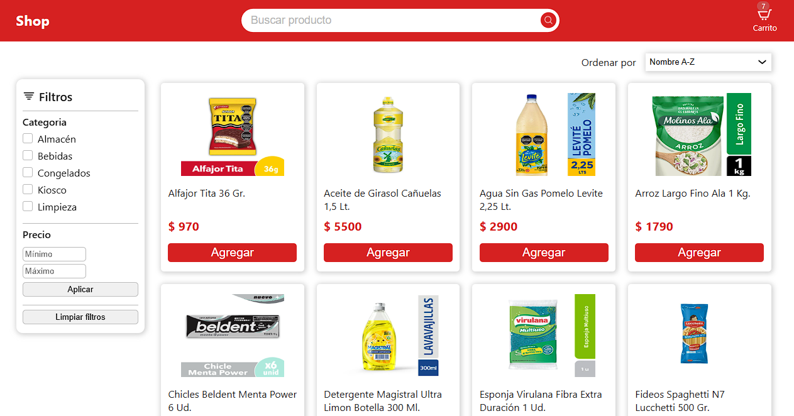
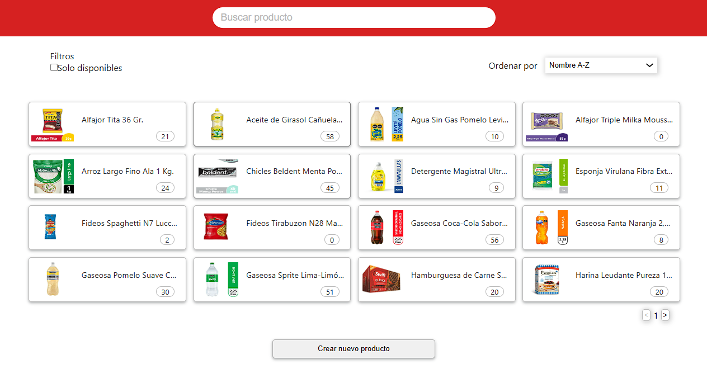
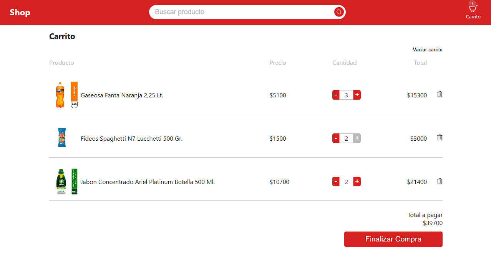
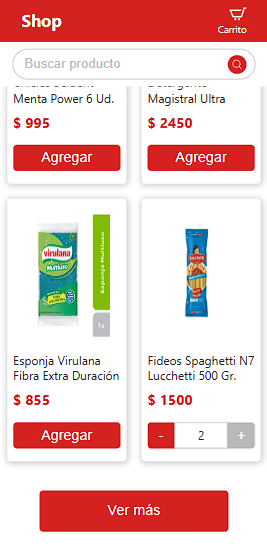

# 🚀 Ecommerce Full Stack - MERN

Este es un proyecto de comercio electrónico completo, diseñado con el stack **MERN** (MongoDB, Express, React y Node.js). La aplicación incluye una experiencia de compra fluida para el usuario y un panel de administración robusto para la gestión de productos.

**🔗 [Link al proyecto en vivo](https://ecommerce-ayerein.netlify.app/)**

---

## 🛠️ Tecnologías utilizadas

### Frontend
* **React (Vite)**
* **Context API** (Manejo de estado global para carrito y productos)
* **CSS Modules** (Estilos modulares y escalables)
* **React Router DOM** (Navegación entre tienda, carrito y administración)
* **Skeleton Loaders** (Optimización de UX para la carga de datos)

### Backend
* **Node.js & Express**
* **MongoDB & Mongoose** (Base de datos NoSQL con esquemas definidos)
* **REST API** (Arquitectura de rutas para productos y categorías)
* **CORS & Dotenv** (Seguridad y manejo de variables de entorno)

---

## ✨ Características clave

* **Experiencia de Usuario (UX):** Uso de *Skeleton Loaders* y estados de carga para una interfaz fluida y profesional.
* **Catálogo Dinámico:** Sistema de búsqueda, filtrado por categorías y ordenamiento (precio y stock) totalmente funcional.
* **Carrito de Compras:** Gestión de productos, cálculo de totales y persistencia de datos.
* **Panel de Administración:** CRUD completo (Crear, Leer, Actualizar, Eliminar) con formularios validados y modales de edición.
* **Diseño Responsivo:** Interfaz adaptada para dispositivos móviles y escritorio.
* **Paginación Dinámica:** Optimización de carga de productos para mejorar el rendimiento.

---

## 📁 Estructura del Proyecto

El repositorio está organizado de forma clara para separar las responsabilidades:

* [`/frontend`](./frontend): Aplicación de React (Cliente).
* [`/backend`](./backend): API de Node.js (Servidor).

---

## 🚀 Instalación y Configuración

Si deseas ejecutar este proyecto localmente:

1.  **Clona el repositorio:**
    ```bash
    git clone [https://github.com/ayerein/Ecommerce.git](https://github.com/ayerein/Ecommerce.git)
    ```

2.  **Configuración del Backend:**
    * Entra a la carpeta: `cd backend`
    * Instala dependencias: `npm install`
    * Crea un archivo `.env` y configura tu `MONGO_URI` y `PORT`.
    * Inicia el servidor: `npm start`

3.  **Configuración del Frontend:**
    * Entra a la carpeta: `cd frontend`
    * Instala dependencias: `npm install`
    * Crea un archivo `.env` con la variable `VITE_API_URL=http://localhost:PUERTO_BACKEND`.
    * Inicia la aplicación: `npm run dev`

---

## 📸 Vista Previa

Para ofrecer una experiencia completa, la aplicación cuenta con interfaces optimizadas para usuarios y administradores:

| 🛒 Vista de Tienda (Desktop) | 🛠️ Panel de Administración |
| :---: | :---: |
|  |  |

| 🛍️ Gestión del Carrito | 📱 Vista Mobile |
| :---: | :---: |
|  |  |

---

## 📝 Nota sobre el despliegue
El backend está alojado en un servidor gratuito. Si es la primera vez que accedes o tras un periodo de inactividad, los **Skeleton Loaders** se mostrarán mientras el servidor se activa (cold start).

---
